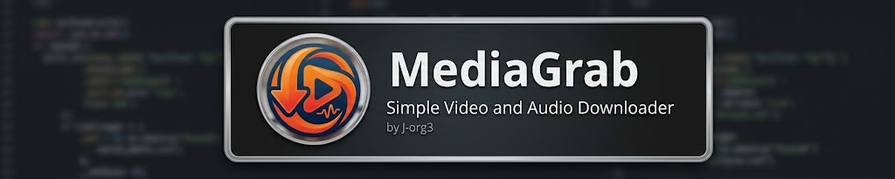

<p align="center">
  
</p>

<p align="center">Simple video &amp; audio downloader</p>

# MediaGrab

A simple, Multi-Platform (YouTube, TikTok, Instagram, X (Twitter), Twitch, Facebook, SoundCloud...) GUI for [yt-dlp](https://github.com/yt-dlp/yt-dlp) by **J-org3**:
paste a link, pick video or audio, pick a save folder, hit Download. Every
finished download lands in the gallery on the right — split into separate
**Videos** / **Audio** sections, file-manager-style rows — double-click to
open, right-click for rename/delete/show-in-folder, and the ↻ button
re-scans the save folder in case you deleted something by hand outside the
app. Audio downloads let you pick the output format (mp3 / wav / opus /
m4a) instead of just a bitrate.


## Installation

Grab the binary for your OS from the **[Releases](../../releases)** page —
no Python, no dependencies, ffmpeg included:

- **Windows** — `MediaGrab-windows.exe`
- **Linux** — `MediaGrab-linux` (`chmod +x` it, then run)

That's it. Both are single self-contained files.

### A note on the Windows SmartScreen warning

Windows will likely show *"Windows protected your PC"* / unknown publisher
the first time you run `MediaGrab-windows.exe`. This is completely normal
for small open-source tools that aren't code-signed — it's the same
warning you'd see on countless GitHub projects before they build up
enough downloads for Microsoft's SmartScreen reputation system, or pay
for a code-signing certificate. Click **More info → Run anyway**. If you
want to verify what you're running first, the full source is right here
in this repo and the build is reproducible (see below) — you can build it
yourself and compare.

## Building from source

Every release is built automatically by
[GitHub Actions](.github/workflows/release.yml) on both Windows and Linux
runners — that workflow is the reference build. To build locally instead:

```bash
git clone <this-repo-url>
cd mediagrab
```

**Windows:**
```
build.bat
```

**Linux:**
```bash
./build.sh
```

Each script creates a virtualenv, installs `yt-dlp`/`customtkinter`/`pillow`/
`pyinstaller` from PyPI, fetches the matching static `ffmpeg` build for your
OS from [BtbN/FFmpeg-Builds](https://github.com/BtbN/FFmpeg-Builds), and
packages everything into one binary next to the script. Nothing is
committed to the repo as a binary blob — ffmpeg is fetched fresh at build
time (both locally and in CI), which is also why the repo itself stays a
few hundred KB instead of a few hundred MB.

## Releasing a new version (maintainer notes)

```bash
git tag v1.0.0
git push --tags
```

Pushing a `v*` tag triggers `.github/workflows/release.yml`, which builds
both platforms and publishes them as a GitHub Release automatically — no
manual upload needed.

## Will this stop working someday? (outdated dependencies)

Short answer: **yes, eventually — and it's handled automatically.**

Of the four dependencies (`yt-dlp`, `customtkinter`, `pillow`, `pyinstaller`),
only one actually goes stale on its own: **`yt-dlp`**. YouTube (and other
sites) regularly change how they serve video/audio URLs — that's what
caused the original "exited with code 1" / HTTP 403 error, an outdated
`yt-dlp` hitting YouTube's "SABR-only" streaming restriction
([yt-dlp#12482](https://github.com/yt-dlp/yt-dlp/issues/12482)).
`customtkinter`/`pillow`/`pyinstaller` are UI/packaging libraries with no
dependency on any external site's behavior — they don't rot the same way.

Two layers fix this so you don't have to babysit it:

1. **`extractor_args: {"youtube": {"player_client": ["android", "web"]}}`**
   in `main.py` avoids the specific restricted client causing the current
   403s.
2. **The release workflow rebuilds itself weekly.** `.github/workflows/release.yml`
   runs every Monday (`schedule: cron`), forces `pip install --upgrade
   yt-dlp` regardless of what's pinned in `requirements.txt`, rebuilds both
   binaries against whatever's current that week, and publishes them to a
   rolling **`auto-latest`** pre-release — separate from your versioned
   `v1.0.0`-style releases, so those stay stable snapshots. If YouTube
   breaks something on a Tuesday, the worst case is you're out of date
   until the following Monday — or trigger it on demand from the **Actions**
   tab → *Build and release* → **Run workflow** any time something breaks.
   `build.bat` / `build.sh` do the same `--upgrade yt-dlp` step for local
   builds.

So: grab `MediaGrab-windows.exe` / `MediaGrab-linux` from the `auto-latest`
release instead of a pinned version tag if you want the freshest extractor
logic at all times.

## Notes

- Video downloads merge to `.mp4`; audio extracts to the format you pick
  (mp3/wav/opus/m4a) — both via the bundled ffmpeg.
- A `.jpg` thumbnail downloads alongside every file and populates the
  gallery row; deleting a gallery item removes both files.
- Download history (including the download date shown in the gallery)
  persists in `history.json` next to the binary.
- `noplaylist` is set, so pasting a playlist URL grabs just the one
  video/track — drop that option in `main.py`'s `_build_opts()` for
  playlist support.
- The bundled ffmpeg build is LGPL (no x264/x265), which is enough for the
  mp4 remux + mp3/wav/opus/m4a extraction this app does.
- UI font is Segoe UI (Windows' native font) throughout.
